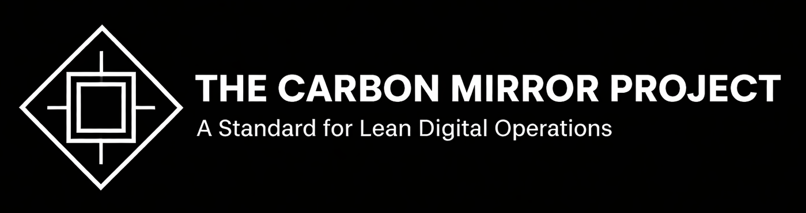

  

The Carbon Mirror Project  
*A Practical Standard for Lean Digital Infrastructure*
 
The Carbon Mirror Project is an open, vendor-neutral framework for understanding and reducing the hidden energy, carbon, and operational waste embedded in modern digital systems.

It is not a sustainability pledge.  
It is not marketing.  
It is not about doing less.

It is a practical method for seeing systems clearly — and operating them with greater efficiency, resilience, and leverage.

This repository contains the **Level 1 Guide**, supporting documents, governance processes, contribution guidelines, and future levels of the Standard.

---

## 📌 What the Carbon Mirror Is

Modern organizations run on computation the way factories once ran on energy and steel.  
The problem: in the digital world, the costs are invisible.

The Carbon Mirror provides:

- A shared language for identifying where digital systems waste energy and money  
- Clear operational patterns for reducing hidden compute overhead  
- A path toward cleaner, more efficient, more resilient digital infrastructure  
- A standards-based certification ladder (Bronze → Silver → Obsidian)  
- Mirror-based audits grounded in real engineering practice  

The Carbon Mirror is built on **four Mirrors** — four ways to see what was previously invisible:

1. **Efficiency Mirror** — Model Right-Sizing  
2. **Timing Mirror** — Grid Literacy  
3. **Data Diet Mirror** — Payload Optimization  
4. **Circularity Mirror** — Waste-to-Yield Thinking  

Each Mirror reveals a different form of digital inefficiency that organizations routinely overlook.

---

## 📘 Current Release: Level 1 Guide  
Located in: `/level-1-guide/`

Level 1 teaches the foundational skills required to “see” digital systems as physical systems:

- Where computation burns unnecessary energy  
- How oversized models and pipelines quietly multiply cost  
- Why timing matters as much as scale  
- How data mass silently drives infrastructure overhead  
- How waste heat becomes a design variable instead of a byproduct  

Level 1 also includes:

- **Pilot project guide**  
- **Certification Ladder**  
- **Obsidian Seal criteria**  
- **Common objections & responses**  
- **Patterns and examples**  

To explore the structure, see:  
`/level-1-guide/SUMMARY.md`

---

## 🛠️ Why This Project Exists

Global compute demand is rising exponentially, driven by AI workloads.  
Electricity costs and carbon intensity are increasingly volatile.  
Regulators are beginning to mandate transparency and heat-reuse feasibility.  
Most organizations still operate blind to these realities.

The Carbon Mirror Project addresses the gap between:

- What engineers optimize (latency, uptime, cost), and  
- What actually matters in a world of constrained energy and rising digital demand.

This Standard exists to turn invisible operational drag into actionable clarity.

---

## 🚦 Who This Standard Is For

- Cloud and platform engineers  
- AI/ML teams  
- Data engineering teams  
- Sustainability and ESG teams  
- CIO/CTO offices  
- Infrastructure architects  
- Researchers and policymakers  

If your organization runs compute at scale, the Carbon Mirror applies to you.

---

## 🌱 Project Maturity

- **Level 1** fully published  
- **Level 2 (Operationalization)** — in draft  
- **Level 3 (Formal Standard)** — upcoming  
- Certification program — design phase  
- Tooling ecosystem — open for contributions  

The Standard is iterative, evidence-based, and informed by real pilot outcomes.

---

## 🤝 Contributing

We welcome contributions that improve clarity, correctness, and depth.

Start here:

- [`CONTRIBUTING.md`](CONTRIBUTING.md) — contribution rules  
- [`CODE_OF_CONDUCT.md`](CODE_OF_CONDUCT.md) — expected behavior  
- [`GOVERNANCE.md`](GOVERNANCE.md) — decision and consensus model  

Templates for contributing:

- Bug reports  
- Documentation fixes  
- Pattern proposals  
- RFC submissions  
- Pull request template  

(Located in `.github/`)

All contributions must be vendor-neutral, evidence-based, and aligned with the philosophy of Lean Digital.

---

## 🧭 Roadmap

The official roadmap is here:  
[`ROADMAP.md`](ROADMAP.md)

Upcoming milestones:

- Level 2 Guide  
- Level 3 Standard  
- Pilot tooling references  
- Certification program  
- Mirror-aligned best-practice library  
- Real-world case studies contributed by practitioners  

---

## 🔒 Licensing

The project is licensed under **Creative Commons BY 4.0**.

You are free to:

- Share  
- Adapt  
- Build upon  

…with attribution.

See [`LICENSE`](LICENSE) for details.

---

## 🔍 The Point

The Carbon Mirror exists for one reason:

**You cannot manage what you cannot see.  
And you cannot improve what you refuse to measure.**

Digital systems may be virtual, but their costs are not.

This project helps organizations capture the opportunity hiding inside that truth.

---

## 🧩 About the Project

This initiative is developed publicly and collaboratively under the `roadpilotai` organization on GitHub.

While initiated by an individual contributor, the intent is to grow into a community-driven standard supported by practitioners, researchers, and engineers committed to clarity and operational excellence.

If you build or operate digital systems, you’re welcome here.

